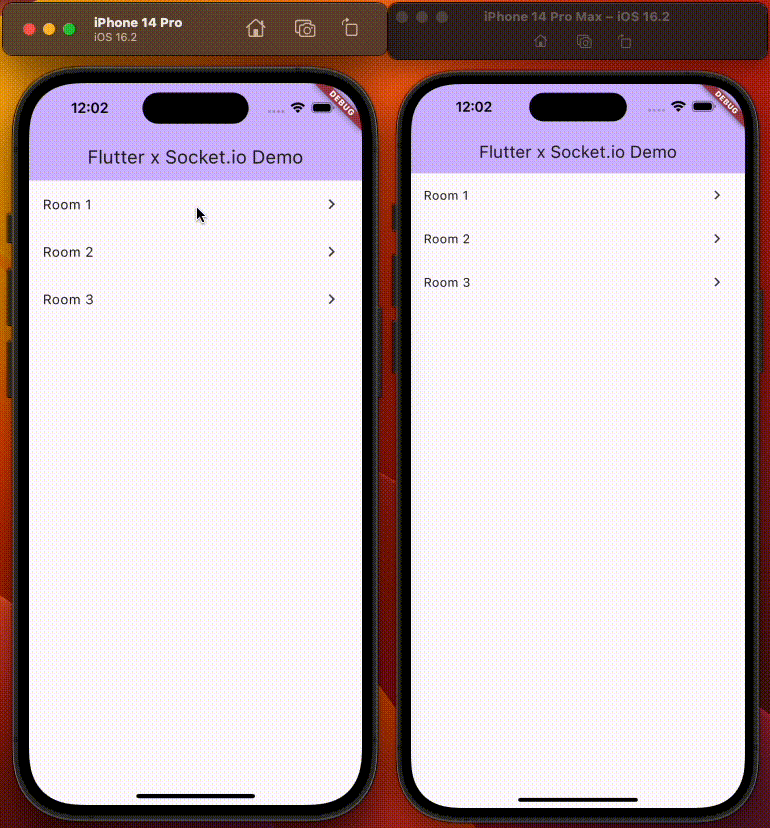

# socket_io_demo

FlutterとSocket.IOを使用したリアルタイム通信のデモアプリ



## セットアップ

```bash
$ git clone https://github.com/takashi0602/socket_io_demo.git

$ cd socket_io_demo

$ fvm flutter pub get

// このデモアプリではユーザー認証などはないため、起動時にユーザーIDをセットする
$ fvm flutter run --dart-define=USER_ID=1
```

## API

- [https://github.com/takashi0602/socket-io-server](https://github.com/takashi0602/socket-io-server)
